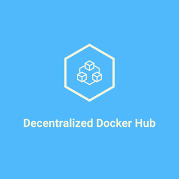

## Decentralized Docker Hub



Using Decentralized Docker Hub, you can easily push and pull docker images
from IPFS and filecoin. It is powered by Powergate. It also has support for ENS domain names.

## Demo Video
https://youtu.be/c0AadtIJmYo


## Getting Started

1) Install Docker and Docker compose
   ```
   https://docs.docker.com/engine/install/#server
   https://docs.docker.com/compose/install/
   ```
   
   Install Go 1.15
   
   https://golang.org/dl/
   
   Once Go is installed then add the following to ~/.bashrc
   
   ```
   export GOPATH=$HOME/go
   export PATH="$GOPATH/bin:$PATH"
   ```
   
   Then run the following command
   ```
   source ~/.bashrc
   ```
      
2) Run Powergate, Lotus and IPFS containers
   
   Ensure that make is installed for your OS
   
   ```
   git clone --depth 1 --branch v0.7.0 https://github.com/textileio/powergate.git
   cd powergate
   make install-pow
   make install-powd
   cd docker
   BIGSECTORS=true make localnet
   ```
   
   Replace the last command above with `make up` for using filecoin testnet instead of localnet
   
   For hosted powergate instance provided by Textile, you can skip the last step and set POW_SERVERADDRESS env variable. 
      
 3) Create a FFS instance from a new tab and note down the token from the output
 
    ```
    pow ffs create
    ```
    
 4) Add token as the environment variable
 
    ```
    export POW_TOKEN={token}
    ```
    
    Replace {token} in the above command with the actual token
    
 5) Determine the docker image that you want to push to IPFS and filecoin
 
    You can either create a new docker image locally or fetch it 
    from another source
    
    You can check the list of existing docker images in your local 
    machine using `docker image ls`
    
    For this tutorial lets use `alpine` docker image since it is a 
    lightweight Linux distribution
    
 6) Clone Decentralized Docker Hub repo
 
    ```
    git clone https://github.com/viraja1/decentralized_docker_hub.git
    cd decentralized_docker_hub
    ```
 
 7) Push alpine image to IPFS and filecoin
 
    ```
    ./ddocker push alpine
    ```
    
    Note down the IPFS cid from the output since it will be required
    for the next step
    
 8) Pull alpine image from IPFS and filecoin
 
    ```
    ./ddocker pull {cid}
    ```
    
    Replace {cid} with the IPFS cid noted from the previous step
    
 9) Create a test container
    ```
    docker container run -it -d alpine
    ```
    
## Pull docker image using ENS domain name

1) Install GO (1.15 or above)

2) Install Ethereal Command line tool  

   Ensure that gcc is installed for your OS before installing ethereal  
   ```
   GO111MODULE=on go get github.com/wealdtech/ethereal@latest
   ```
   
3) Get the IPFS hash of the docker image and set it as the content hash of your ENS domain

   https://app.ens.domains/

4) Pull docker image from IPFS and filecoin using ENS domain name

   ```
   ./ddocker pull {ens_domain_name}
   ```
   
   Replace {ens_domain_name} with the actual ENS domain name (defaults to ENS mainnet)
   
   For ropsten or other testnet, you can specify network at the end
   
   e.g. 
   ```
   ./ddocker pull alpine.docker.eth ropsten
   ```

   